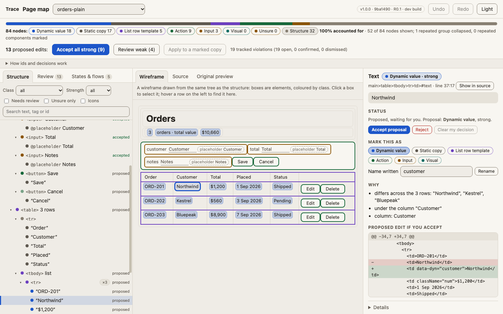
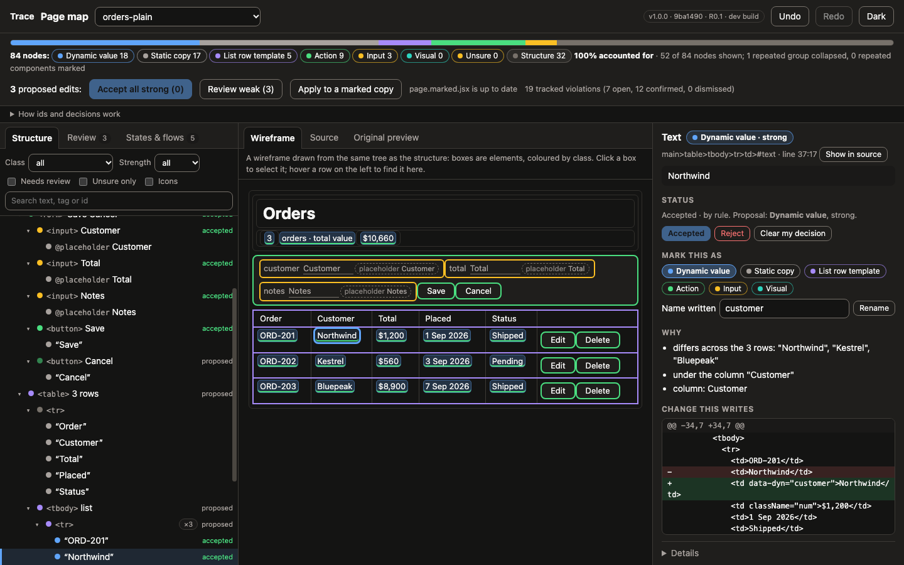
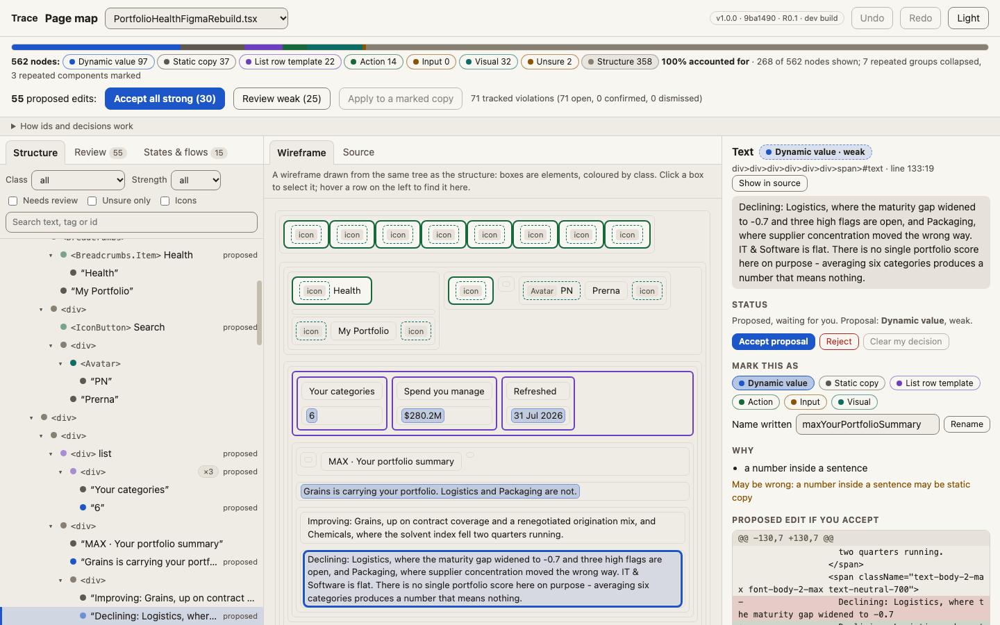
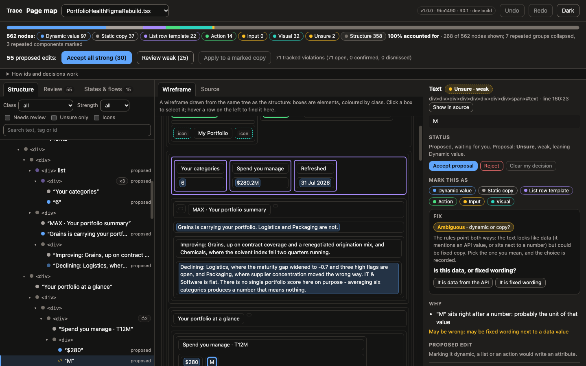

# Page map v1: review pack

Generated by `node scripts/pagemap-review.mjs` (read-only, deterministic). Branch `line-matcher-pagemap`, worktree `construct-worktrees/line-matcher-pagemap`. Nothing here is committed or released; the design sources and the examples are unchanged.

## What was built

A new page, `/pagemap`, that lists **every element and text node** of a designed page (JSX or TSX), gives each one a stable id and a **proposed class with a strength, reasons and a false-positive risk**, collapses repeated rows and cards into one template with a count, and lets you **accept, reject, change or add** each proposal on screen. Every decision is a saved, undoable step in a sidecar (`pagemap.json` + `pagemap.history.jsonl`); the design source is never touched. `Apply to a marked copy` writes `page.marked.jsx|tsx` next to the source with exact-offset splices (idempotent, byte-deterministic), and replacing the page is a second, explicit step.

- Engine (pure, deterministic): `src/pagemap/inventory.mjs` (node tree), `collapse.mjs` (repetition), `classify.mjs` (proposals, reusing the import block's suggestMarkers rules through `planMarkers` plus contract, header, stat-card and row-slot rules), `apply.mjs` (marked copy, diffs), `store.mjs` (decisions + history), `service.mjs`, `contract-match.mjs`, `preview.mjs` (wireframe with a `data-pm-id` per node).
- Routes: `src/pagemap-routes.mjs` (one line of wiring in `src/server.mjs`): `GET /pagemap`, `GET /api/pagemap`, `POST /api/pagemap/decide | undo | redo | apply | use`; all behind `src/http-guard.mjs`.
- UI: `src/ui/pagemap.{html,mjs,css}` (plain JS, one delegated handler, both themes, keyboard operable). Design: `docs/PAGEMAP.md`.

## The tree of `PortfolioHealthFigmaRebuild.tsx` with repetition collapsed

- **Before:** 562 nodes (136 text nodes, 289 layout boxes, 14 interactions, 91 table/list parts, 32 media/visuals).
- **After:** 268 nodes shown; 7 repeated groups collapsed to one template each (the biggest: the 6-row table); 3 repeated components marked (`
` x2, `
` x2, `
` x2).
- **Coverage:** 562 nodes: 97 dynamic, 37 static copy, 14 actions, 0 inputs, 22 list parts, 32 visuals, 358 structure, 2 unsure (static until decided); 100% of nodes accounted for. (Layout-only boxes are listed as structure.)

Below: content nodes only (layout boxes with one child folded into their child, icons hidden), class in backticks (`?` = weak).

- 

  - <SideNav>
    - <SideNav.NavItem> Home `action?`
    - <SideNav.NavItem> List Checks `action?`
    - <SideNav.NavItem> Shield `action?`
    - <SideNav.NavItem> Gauge `action?`
    - <SideNav.NavItem> Activity `action?`
    - <SideNav.NavItem> Message Square `action?`
    - <SideNav.NavItem> File Text `action?`
    - <SideNav.NavItem> Sparkles `action?`
  - 

    - 

      - <Breadcrumbs>
        - <Breadcrumbs.Item> Health `action?`
          - "Health" `static`
        - "My Portfolio" `static`
      - 

        - <IconButton> Search `action?`
        - 

          - <Avatar> `visual`
            - "PN" `static`
          - "Prerna" `static`
    - 

      - 

        - 
 list `list?`
          - 
 **x3** varies: "Your categories" / "Spend you manage" / "Refreshed"; "6" / "$280.2M" / "31 Jul 2026" `list?`
            - "Your categories" `static`
            - "6" `dynamic`
        - 

          - "MAX · Your portfolio summary" `static`
          - "Grains is carrying your portfolio. Logistics and Packaging are not." `dynamic`
          - 

            - "Improving: Grains, up on contract coverage and a renegotiated origina…" `static`
            - "Declining: Logistics, where the maturity gap widened to -0.7 and thre…" `dynamic?`
      - 

        - "Your portfolio at a glance" `static`
        - 

          - 

            - 

              - "Spend you manage · T12M" `static`
              - 

                - "$280" `dynamic`
                - "M" `unsure?`
              - "▲ 8.4% YoY" `dynamic`
              - "Across the six categories assigned to you. Grains & Cereals is 33% of…" `dynamic`
            - 

              - "Savings potential" `static`
              - 

                - "$24.5" `dynamic`
                - "M" `unsure?`
              - "38% of qualified savings initiatives accepted" `dynamic`
              - "Sum of the mid-point estimate from each of your six categories. 23 of…" `dynamic?`
          - 

            - 

              - "Resilience based initiatives" `static`
              - "21" `dynamic`
              - "7 high · 13 medium · 1 low." `dynamic?`
              - "4 categories carry at least one high." `dynamic?`
            - 

              - "Number of savings initiatives" `static`
              - "26" `dynamic`
              - "target $42.0M" `dynamic?`
              - "Savings initiatives raised but not yet accepted by an owner. Oldest h…" `dynamic?`
            - 
 list `list?`
              -  **x3** varies: "Risk initiatives" / "6" / "resilience initiatives · 2 …" `list?`
                - "Risk initiatives" `static`
              - "target 8.0" `dynamic?`
              - "Risk reduction awaiting a decision. Not measured in savings, so it is…" `static`
      - 

        - "Ask Anything about your portfolio" `static`
        - 

          - "Suggestions" `static`
          - <Button> Prompt suggestion 01 `action`
            - "Prompt suggestion 01" `static`
          - <Button> Prompt suggestion 02 `action`
            - "Prompt suggestion 02" `static`
      - 

        - 

          - "Category overview" `static`
          - "Order based on top spend categories (Top 10) within that ordered by t…" `dynamic?`
        - 

          - <Table> 6 rows `list`
            - <Table.HeaderRow>
              - "#" `static`
              - "Category" `static`
              - "Spend" `static`
              - "Maturity" `static`
              - "Savings potential" `static`
              - "Needs attention" `static`
              - "Trend" `static`
            - <Table.Row> **x6** varies: "01" / "02" / "03"; "Logistics" / "Packaging" / "IT Services"; "L3" / "L2" `list`
              - "01" `dynamic`
              - 

                - 

                  - "Logistics" `dynamic`
                  - "L3" `dynamic`
                - <Badge> **x3** varies: "3 high flags" / "widest maturity gap -0.7" / "$740K overdue 12d"
                  - "3 high flags" `dynamic`
              - 

                - "$38.4M" `dynamic`
                - "13.7%" `dynamic`
              - 

                - 

                  - "2.0" `dynamic`
                  - "-0.7" `dynamic`
                - "peer 2.7" `dynamic`
              - 

                - "$5.6M" `dynamic`
                - "14.6%" `dynamic`
              - <svg> `visual`
          - 
 list `list?`
            - 
 **x6** varies: "Identified opportunities" / "Maturity gap to peer median" / "Portfolio average 70" `list?`
              - "Identified opportunities" `static`
      - 

        - "Ask Anything about your portfolio" `static`
        - 

          - "Suggestions" `static`
          - <Button> Prompt suggestion 01 `action`
            - "Prompt suggestion 01" `static`
          - <Button> Prompt suggestion 02 `action`
            - "Prompt suggestion 02" `static`

## Suggested edits for `PortfolioHealthFigmaRebuild.tsx`

Every row is a proposal you accept, reject or change in the page; nothing is written until you accept. A repeated row is one proposal (x N = its instances follow it). Static copy, visuals and layout need no edit and are not listed (37 static, 32 visuals).

### Dynamic values, strong (25)

| Line | Node | Text | Class | Why | Edit |
|---:|---|---|---|---|---|
| 92 | text | 6 | dynamic/strong | matches money/number | add `data-dyn="yourCategories"` to `` (line 91) |
| 100 | text | $280.2M | dynamic/strong | matches money/number | add `data-dyn="spendYouManage"` to `` (line 99) |
| 108 | text | 31 Jul 2026 | dynamic/strong | matches a date (D Mon YYYY) | add `data-dyn="refreshed"` to `` (line 107) |
| 123 | text | Grains is carrying your portfolio. Logistics … | dynamic/strong | equals the API example narrative.cross_l2_summary | add `data-dyn="maxYourPortfolioSummary"` to `` (line 122) |
| 157 | text | $280 | dynamic/strong | matches money/number | add `data-dyn="yourPortfolioAtA"` to `` (line 156) |
| 164 | text | ▲ 8.4% YoY | dynamic/strong | matches a ▲/▼ delta | add `data-dyn="yourPortfolioAtA2"` to `` (line 163) |
| 167 | text | Across the six categories assigned to you. Gr… | dynamic/strong | "33%" equals the API example portfolio_at_a_glance.largest_category.share_of_portfolio (May be wrong: the rest of the sentence stays fixed wording) | wrap `33%` in `` (line 168) |
| 177 | text | $24.5 | dynamic/strong | matches money/number | add `data-dyn="savingsPotential"` to `` (line 176) |
| 184 | text | 38% of qualified savings initiatives accepted | dynamic/strong | "38%" equals the API example portfolio_at_a_glance.savings_potential.qualified_accepted_pct (May be wrong: the rest of the sentence stays fixed wordi… | wrap `38%` in `` (line 184) |
| 200 | text | 21 | dynamic/strong | matches money/number | add `data-dyn="resilienceBasedInitiatives"` to `` (line 199) |
| 242 | text | 26 | dynamic/strong | matches money/number | add `data-dyn="numberOfSavingsInitiatives"` to `` (line 241) |
| 266 | text | 6 | dynamic/strong | matches money/number | add `data-dyn="riskInitiatives"` to `` (line 265) |
| 353 | text x6 | 01 | dynamic/strong | looks like a number; differs across the rows: "01", "02", "03", "04"; under the column "#" | add `data-dyn="rank"` to `` (line 352) |
| 360 | text x6 | Logistics | dynamic/strong | differs across the 6 rows: "Logistics", "Packaging", "IT Services", "Professional Services"; under the column "Category" | add `data-dyn="category"` to `` (line 359) |
| 363 | text x6 | L3 | dynamic/strong | differs across the 6 rows: "L3", "L2"; under the column "Category" | add `data-dyn="category2"` to `` (line 362) |
| 368 | text x6 | 3 high flags | dynamic/strong | differs across the 6 rows: "3 high flags", "largest unclaimed $7.1M", "single supplier 9.5%", "1 high flag"; under the column "Category" | add `data-dyn="category3"` to `<Badge>` (line 367) |
| 371 | text x6 | widest maturity gap -0.7 | dynamic/strong | differs across the 6 rows: "widest maturity gap -0.7", "2 high flags", "$410K past due", "rate card 14% over peers"; under the column "Category" | add `data-dyn="category4"` to `<Badge>` (line 370) |
| 374 | text x3 | $740K overdue 12d | dynamic/strong | differs across the 6 rows: "$740K overdue 12d", "$1.1M due in 3d", "maturity flat 2 quarters"; under the column "Category" | add `data-dyn="category5"` to `<Badge>` (line 373) |
| 382 | text x6 | $38.4M | dynamic/strong | matches money/number; differs across the rows: "$38.4M", "$62.8M", "$45.2M", "$27.3M"; under the column "Spend" | add `data-dyn="spend"` to `` (line 381) |
| 385 | text x6 | 13.7% | dynamic/strong | matches a percent; differs across the rows: "13.7%", "22.4%", "16.1%", "9.7%"; under the column "Spend" | add `data-dyn="spend2"` to `` (line 384) |
| 393 | text x6 | 2.0 | dynamic/strong | matches money/number; differs across the rows: "2.0", "1.8", "2.1", "2.3"; under the column "Maturity" | add `data-dyn="maturity"` to `` (line 392) |
| 396 | text x6 | -0.7 | dynamic/strong | matches money/number; differs across the rows: "-0.7", "-0.6", "-0.5", "-0.2"; under the column "Maturity" | add `data-dyn="maturity2"` to `` (line 395) |
| 400 | text x6 | peer 2.7 | dynamic/strong | differs across the 6 rows: "peer 2.7", "peer 2.4", "peer 2.6", "peer 2.5"; under the column "Maturity" | add `data-dyn="maturity3"` to `` (line 399) |
| 408 | text x6 | $5.6M | dynamic/strong | matches money/number; differs across the rows: "$5.6M", "$7.1M", "$4.2M", "$2.9M"; under the column "Savings potential" | add `data-dyn="savingsPotential"` to `` (line 407) |
| 411 | text x6 | 14.6% | dynamic/strong | matches a percent; differs across the rows: "14.6%", "11.3%", "9.3%", "10.6%"; under the column "Savings potential" | add `data-dyn="savingsPotential2"` to `` (line 410) |

### Dynamic values, weak (10)

| Line | Node | Text | Class | Why | Edit |
|---:|---|---|---|---|---|
| 133 | text | Declining: Logistics, where the maturity gap … | dynamic/weak | a number inside a sentence (May be wrong: a number inside a sentence may be static copy) | wrap `0.7` in `` (line 133) |
| 187 | text | Sum of the mid-point estimate from each of yo… | dynamic/weak | an "N of M" count inside a sentence (May be wrong: a number inside a sentence may be static copy) | wrap `23 of 60` in `` (line 188) |
| 230 | text | 7 high · 13 medium · 1 low. | dynamic/weak | a number inside a sentence (May be wrong: a number inside a sentence may be static copy) | wrap `7` in `` (line 230); wrap `13` in `` (line 230); wrap `1` in `` (line 230) |
| 233 | text | 4 categories carry at least one high. | dynamic/weak | a number inside a sentence (May be wrong: a number inside a sentence may be static copy) | wrap `4` in `` (line 233) |
| 252 | text | target $42.0M | dynamic/weak | label that starts with or holds a number (May be wrong: may be a static label; the number is part of a phrase) | add `data-dyn="numberOfSavingsInitiatives2"` to `` (line 251) |
| 256 | text | Savings initiatives raised but not yet accept… | dynamic/weak | a number inside a sentence (May be wrong: a number inside a sentence may be static copy) | wrap `34` in `` (line 257) |
| 269 | text | resilience initiatives · 2 categories | dynamic/weak | a number inside a sentence (May be wrong: a number inside a sentence may be static copy) | wrap `2` in `` (line 269) |
| 279 | text | target 8.0 | dynamic/weak | label that starts with or holds a number (May be wrong: may be a static label; the number is part of a phrase) | add `data-dyn="riskInitiatives3"` to `` (line 278) |
| 326 | text | Order based on top spend categories (Top 10) … | dynamic/weak | a number inside a sentence (May be wrong: a number inside a sentence may be static copy) | wrap `10` in `` (line 326) |
| 950 | text | Portfolio average 70 | dynamic/weak | a number inside a sentence (May be wrong: a number inside a sentence may be static copy) | wrap `70` in `` (line 950) |

### Lists (4)

| Line | Node | Text | Class | Why | Edit |
|---:|---|---|---|---|---|
| 86 | `
` | list | list/weak | 3 sibling 
 elements with the same structure (May be wrong: rows carry fewer than 3 texts (a stat strip, legend or label/value pairs?)) | add `data-list="prerna"` to `
` (line 86) |
| 261 | `
` | list | list/weak | 4 sibling  elements with the same structure (May be wrong: rows carry fewer than 3 texts (a stat strip, legend or label/value pairs?)) | add `data-list="items4"` to `
` (line 261) |
| 333 | `<Table>` | 6 rows | list/strong | 6 Table.Row children (the first is the template) | add `data-list="categoryOverview"` to `<Table>` (line 333) |
| 934 | `
` | list | list/weak | 6 sibling 
 elements with the same structure (May be wrong: rows carry fewer than 3 texts (a stat strip, legend or label/value pairs?)) | add `data-list="items5"` to `
` (line 934) |

### Actions (14)

| Line | Node | Text | Class | Why | Edit |
|---:|---|---|---|---|---|
| 31 | `<SideNav.NavItem>` | Home | action/weak | SideNav.NavItem with no handler in the design (May be wrong: navigation: sidebar, breadcrumbs and menu items are usually static) | add `data-action="home"` to `<SideNav.NavItem>` (line 31) |
| 32 | `<SideNav.NavItem>` | List Checks | action/weak | SideNav.NavItem with no handler in the design (May be wrong: navigation: sidebar, breadcrumbs and menu items are usually static) | add `data-action="listChecks"` to `<SideNav.NavItem>` (line 32) |
| 33 | `<SideNav.NavItem>` | Shield | action/weak | SideNav.NavItem with no handler in the design (May be wrong: navigation: sidebar, breadcrumbs and menu items are usually static) | add `data-action="shield"` to `<SideNav.NavItem>` (line 33) |
| 34 | `<SideNav.NavItem>` | Gauge | action/weak | SideNav.NavItem with no handler in the design (May be wrong: navigation: sidebar, breadcrumbs and menu items are usually static) | add `data-action="gauge"` to `<SideNav.NavItem>` (line 34) |
| 40 | `<SideNav.NavItem>` | Activity | action/weak | SideNav.NavItem with no handler in the design (May be wrong: navigation: sidebar, breadcrumbs and menu items are usually static) | add `data-action="activity"` to `<SideNav.NavItem>` (line 40) |
| 41 | `<SideNav.NavItem>` | Message Square | action/weak | SideNav.NavItem with no handler in the design (May be wrong: navigation: sidebar, breadcrumbs and menu items are usually static) | add `data-action="messageSquare"` to `<SideNav.NavItem>` (line 41) |
| 42 | `<SideNav.NavItem>` | File Text | action/weak | SideNav.NavItem with no handler in the design (May be wrong: navigation: sidebar, breadcrumbs and menu items are usually static) | add `data-action="fileText"` to `<SideNav.NavItem>` (line 42) |
| 43 | `<SideNav.NavItem>` | Sparkles | action/weak | SideNav.NavItem with no handler in the design (May be wrong: navigation: sidebar, breadcrumbs and menu items are usually static) | add `data-action="sparkles"` to `<SideNav.NavItem>` (line 43) |
| 51 | `<Breadcrumbs.Item>` | Health | action/weak | Breadcrumbs.Item with no handler in the design (May be wrong: navigation: sidebar, breadcrumbs and menu items are usually static) | add `data-action="health"` to `<Breadcrumbs.Item>` (line 51) |
| 64 | `<IconButton>` | Search | action/weak | IconButton with an onClick (May be wrong: search control (UI filter)) | add `data-action="search"` to `<IconButton>` (line 64) |
| 302 | `<Button>` | Prompt suggestion 01 | action/strong | Button with an onClick | add `data-action="promptSuggestion01"` to `<Button>` (line 302) |
| 310 | `<Button>` | Prompt suggestion 02 | action/strong | Button with an onClick | add `data-action="promptSuggestion02"` to `<Button>` (line 310) |
| 986 | `<Button>` | Prompt suggestion 01 | action/strong | Button with an onClick | add `data-action="promptSuggestion01"` to `<Button>` (line 986) |
| 994 | `<Button>` | Prompt suggestion 02 | action/strong | Button with an onClick | add `data-action="promptSuggestion02"` to `<Button>` (line 994) |

### Inputs

None.

### Unsure (rules disagree; nothing is written until you pick) (2)

| Line | Node | Text | Class | Why | Edit |
|---:|---|---|---|---|---|
| 160 | text | M | unsure/weak | "M" sits right after a number: probably the unit of that value (May be wrong: may be fixed wording next to a data value) | add `data-dyn="m"` to `` (line 159) (leans dynamic) |
| 180 | text | M | unsure/weak | "M" sits right after a number: probably the unit of that value (May be wrong: may be fixed wording next to a data value) | add `data-dyn="m"` to `` (line 179) (leans dynamic) |

## States and conditionals (requirement items for Product and Design)

The inventory now finds what the design shows only sometimes and lists each as a **state record** (kind `state`, its own stable id, linked to the element it affects, with the condition text and a proposed requirement item for Product or Design): conditional rendering (`cond && <X/>`, ternaries incl. the else branch as `not (cond)`, a `.map()` with an empty branch), state props (`disabled`, `aria-disabled/-selected/-expanded/-busy/-checked/-pressed/-invalid/-current`, `selected`, `active`, `loading`, `checked`, `expanded`, `variant="selected|active|disabled|..."`), state class tokens, skeleton/animate-pulse elements and loading/empty/error wording. They are records, not tree nodes, so the tree's 100% coverage and every node id are unchanged. In the page they are under **States & flows**: keep as a requirement, or dismiss (a decision, undoable). States found: PortfolioHealthFigmaRebuild.tsx: 1, PortfolioHealthFigmaRebuild2.tsx: 1, RedesignedPortfolioHealth.tsx: 1. The Subframe pages are static snapshots (one selected nav item each), so the finder is pinned by a test on a sample with every source instead (`src/pagemap/pagemap.test.mjs`). For `PortfolioHealthFigmaRebuild.tsx`:

| Line | State | From | Condition | Element | Team | Proposed requirement |
|---:|---|---|---|---|---|---|
| 37 | selected | prop (selected) | `true` | `<SideNav.NavItem>` | Design | Design the selected/active variant of <SideNav.NavItem> and Product: what selects it? |

## Interactions and where they resolve

Flow rule: every interaction resolves to an **API endpoint**, a **controller function** or a **marked stub**; a stub is any function with an unused input or nothing returned. 14 interactions on this page: 9 unresolved, 5 stub. The verb comes from the label; the contract is read through the existing matcher; no model.

| Line | Interaction | Action | Resolves to | Handler | Detail |
|---:|---|---|---|---|---|
| 31 | Home | `home` | unresolved | none | "home" is not a known action and there is no handler |
| 32 | List Checks | `listChecks` | unresolved | none | "listChecks" is not a known action and there is no handler |
| 33 | Shield | `shield` | unresolved | none | "shield" is not a known action and there is no handler |
| 34 | Gauge | `gauge` | unresolved | none | "gauge" is not a known action and there is no handler |
| 40 | Activity | `activity` | unresolved | none | "activity" is not a known action and there is no handler |
| 41 | Message Square | `messageSquare` | unresolved | none | "messageSquare" is not a known action and there is no handler |
| 42 | File Text | `fileText` | unresolved | none | "fileText" is not a known action and there is no handler |
| 43 | Sparkles | `sparkles` | unresolved | none | "sparkles" is not a known action and there is no handler |
| 51 | Health | `health` | unresolved | none | "health" is not a known action and there is no handler |
| 64 | Search | `search` | stub | stub | a marked stub to write: empty body, input "event" unused |
| 302 | Prompt suggestion 01 | `promptSuggestion01` | stub | stub | a marked stub to write: empty body, input "event" unused |
| 310 | Prompt suggestion 02 | `promptSuggestion02` | stub | stub | a marked stub to write: empty body, input "event" unused |
| 986 | Prompt suggestion 01 | `promptSuggestion01` | stub | stub | a marked stub to write: empty body, input "event" unused |
| 994 | Prompt suggestion 02 | `promptSuggestion02` | stub | stub | a marked stub to write: empty body, input "event" unused |

## Tracked violations

Markers are suggested by Trace, confirmed by you and stored as violations (Construct's `makeViolation` shape: rule, severity, file, line, message, why, expected, suggestedFix, plus id, nodeId, status, team) in the sidecar's `violations` key after every change. `PortfolioHealthFigmaRebuild.tsx`: **71** (71 open); by rule: `pagemap/action` 14, `pagemap/chart-mapping` 1, `pagemap/dynamic-value` 35, `pagemap/interaction-stub` 5, `pagemap/interaction-unresolved` 9, `pagemap/list` 4, `pagemap/state/selected` 1, `pagemap/unsure` 2. Sample:

- `pagemap/action` (info) line 31: <SideNav.NavItem> Home looks like a control that should call the API (weak). Why: SideNav.NavItem with no handler in the design. May be wrong: navigation: sidebar, breadcrumbs and menu items are usually static. Fix: add `data-action="home"` to `<SideNav.NavItem>` (line 31)
- `pagemap/interaction-unresolved` (warning) line 31: "Home" has no API endpoint, controller function or marked stub. Why: "home" is not a known action and there is no handler Fix: Give "Home" an action: pick an endpoint or a controller function, or mark it a stub.
- `pagemap/action` (info) line 32: <SideNav.NavItem> List Checks looks like a control that should call the API (weak). Why: SideNav.NavItem with no handler in the design. May be wrong: navigation: sidebar, breadcrumbs and menu items are usually static. Fix: add `data-action="listChecks"` to `<SideNav.NavItem>` (line 32)
- `pagemap/interaction-unresolved` (warning) line 32: "List Checks" has no API endpoint, controller function or marked stub. Why: "listChecks" is not a known action and there is no handler Fix: Give "List Checks" an action: pick an endpoint or a controller function, or mark it a stub.

## Measured against the hand-marked pages

Ground truth: `examples/portfolio-figma-1`, `portfolio-figma-2`, `portfolio-redesigned` (hand-marked `page.jsx`), the same three designs as the Subframe pages; compared by text (`eval/pagemap.mjs`, `node eval/pagemap.mjs`, results also in `eval/out/pagemap.{json,md}`). "Import rules" are the old suggestMarkers rules alone, recomputed here; their extracted/matched numbers (16/4, 15/5, 13/4 against 36/15, 36/15, 25/7) equal the recorded baseline.

#### PortfolioHealthFigmaRebuild.tsx

| Dynamic proposals | Proposed | Right | Precision | Recall of hand-marked values |
|---|---:|---:|---:|---:|
| Page map, strong only | 87 | 80 | 92% | 83% |
| Page map, strong + weak | 101 | 87 | 86% | 91% |
| Import rules, strong only (before) | 51 | 49 | 96% | 54% |
| Import rules, strong + weak (before) | 102 | 90 | 88% | 90% |

Lists: hand-marked 1 list of 6 rows; the page map proposes 4 lists (1 strong), 1 of them the right one. Actions: hand-marked 3 labels; strong proposals 4 (precision 100%, recall 67%); with weak 14 (precision 29%). Text nodes: 136, all classified (97 dynamic, 37 static, 2 unsure).

| Pipeline on the marked page | Parts extracted | Matched to one API source |
|---|---:|---:|
| Hand-marked page (ceiling) | 36 | 15 |
| Import rules, strong accepted (before) | 16 | 4 |
| Page map, strong accepted | 25 | 10 |
| Page map, strong + weak values/fields | 39 | 13 |

#### PortfolioHealthFigmaRebuild2.tsx

| Dynamic proposals | Proposed | Right | Precision | Recall of hand-marked values |
|---|---:|---:|---:|---:|
| Page map, strong only | 86 | 81 | 94% | 84% |
| Page map, strong + weak | 99 | 89 | 90% | 93% |
| Import rules, strong only (before) | 50 | 50 | 100% | 55% |
| Import rules, strong + weak (before) | 102 | 92 | 90% | 92% |

Lists: hand-marked 1 list of 6 rows; the page map proposes 4 lists (1 strong), 1 of them the right one. Actions: hand-marked 3 labels; strong proposals 4 (precision 100%, recall 67%); with weak 15 (precision 27%). Text nodes: 145, all classified (97 dynamic, 48 static, 0 unsure).

| Pipeline on the marked page | Parts extracted | Matched to one API source |
|---|---:|---:|
| Hand-marked page (ceiling) | 36 | 15 |
| Import rules, strong accepted (before) | 15 | 5 |
| Page map, strong accepted | 24 | 11 |
| Page map, strong + weak values/fields | 37 | 14 |

#### RedesignedPortfolioHealth.tsx

| Dynamic proposals | Proposed | Right | Precision | Recall of hand-marked values |
|---|---:|---:|---:|---:|
| Page map, strong only | 83 | 72 | 87% | 88% |
| Page map, strong + weak | 92 | 76 | 83% | 92% |
| Import rules, strong only (before) | 43 | 41 | 95% | 59% |
| Import rules, strong + weak (before) | 91 | 81 | 89% | 92% |

Lists: hand-marked 1 list of 6 rows; the page map proposes 3 lists (1 strong), 1 of them the right one. Actions: hand-marked 3 labels; strong proposals 0 (precision n/a, recall 0%); with weak 12 (precision 0%). Text nodes: 151, all classified (90 dynamic, 61 static, 0 unsure).

| Pipeline on the marked page | Parts extracted | Matched to one API source |
|---|---:|---:|
| Hand-marked page (ceiling) | 25 | 7 |
| Import rules, strong accepted (before) | 13 | 4 |
| Page map, strong accepted | 19 | 7 |
| Page map, strong + weak values/fields | 28 | 7 |

**Read this honestly.** With strong proposals only, the page map recovers 83%, 84%, 88% of the hand-marked values (the import rules alone: 54%, 55%, 59%) at 92%, 94%, 87% precision (96%, 100%, 95% before): more coverage for a few points of precision. Accepting the strong proposals gives 25/10, 24/11, 19/7 parts extracted/matched against 16/4, 15/5, 13/4 before and 36/15, 36/15, 25/7 hand-marked. It beats the earlier baseline on every page, but it does not reach the hand-marked pages: the remaining gap is mostly numbers inside sentences (weak, each wants a person), narrative text that names no API value, and values the API does not carry (a design-versus-contract gap, which is what Trace is for). Action recall is limited by design differences: the hand pages add an "Open" button per row that the Subframe pages do not have, and the redesigned page's prompts are components without handlers.

## Screenshots (1440x900, both themes)

| | Light | Dark |
|---|---|---|
| A JSX example (orders, markers removed) |  |  |
| A real Subframe page |  |  |

The other two real pages, both themes: `docs/pagemap/subframe2-{light,dark}.png` and `docs/pagemap/redesigned-{light,dark}.png` (all three load with 200; a test covers them). The orphan UI (summary count, damaged-sidecar warning, help box, Drop control): `docs/pagemap/orphans-{light,dark}.png`. More: the review list (`docs/pagemap/subframe-review-light.png`), the marked-copy dialog with the second step (`docs/pagemap/apply-dialog-light.png`), the source tab (`docs/pagemap/subframe-source-dark.png`). Regenerate with `node scripts/pagemap-shots.mjs` (it also fails on any console error).

## How to review

1. `cd line-matcher && node src/server.mjs --port 4300 --no-open` (from this worktree). To keep your examples clean, add `--examples /path/to/a/copy` and copy `subframe-app/src/pages` next to it; decisions are written into the example's folder.
2. Open **http://localhost:4300/pagemap?file=PortfolioHealthFigmaRebuild.tsx** (a real page: 562 nodes), then `?file=PortfolioHealthFigmaRebuild2.tsx` and `?file=RedesignedPortfolioHealth.tsx`.
3. Open **http://localhost:4300/pagemap?example=portfolio-figma-1** (a hand-marked JSX page: existing markers show as *accepted*) and any other `?example=<name>`.
4. Try: click a text in the wireframe; read the reasons and the diff; **Accept all strong**, then **Review weak** and decide a few; mark an unsuggested text as dynamic; **Undo**; **Apply to a marked copy** and read the diff. The second step (Use as the page) only exists for examples.
5. Check hardest: the weak proposals' reasons, the "Unsure" nodes (Fix area), and whether collapsing hid anything you expected to see (expand a group with its x N badge).

## Rules you set, and how they are honoured

Also recorded in `docs/PAGEMAP.md`: two identical texts in different places are TWO parts (ids contain the position; a test pins it); text that is neither marked nor static is static at least (an unsure node counts as static until decided, nothing is written for it); suggested markers are stored as violations; table content is tracked by row and column index (`details.row`/`col`, shown in the panel); charts are summarised by mapping (labels inside a graphic, each with the data items of the contract it could stand for; nothing is guessed silently). Construct gap: `makeViolation` only accepts a `module` from three closed values, so Trace builds the same field set itself and a test validates it against Construct's function with `module: "readability"`.

## Known limits

- The middle pane is a wireframe drawn from the same tree (components are boxes, Tailwind is not interpreted beyond flex/grid direction), not the rendered design. A click on the *rendered* Subframe app selecting a node needs its dev preview running with Construct's annotator; the positions already agree (a test pins that), the overlay is not built. See `docs/PAGEMAP.md`.
- Matching between the hand-marked and the Subframe page is by text, so a hand page that splits a value differently (`$280` + `M` versus `$280M`) counts as a miss.
- A decision applies only while the node at its id still matches the signature stored with it (kind, tag, path, text, structure); if not it is an orphan, never re-anchored silently, so apply and use cannot mark a different node. A damaged sidecar is dropped entry by entry with visible warnings.
- Node ids are **positional** (file + line:col + tag path): any edit that moves a line, even whitespace, changes ids and orphans the decisions made on them. Orphans are counted in the summary line, listed under States & flows, and can be re-attached (decide again on the node now there) or dropped; nothing is silently re-mapped.
- "Use as the page" never overwrites a backup: the first original stays `page.before-pagemap.jsx`, later ones are `.2`, `.3`; undo = copy a backup over the page.
